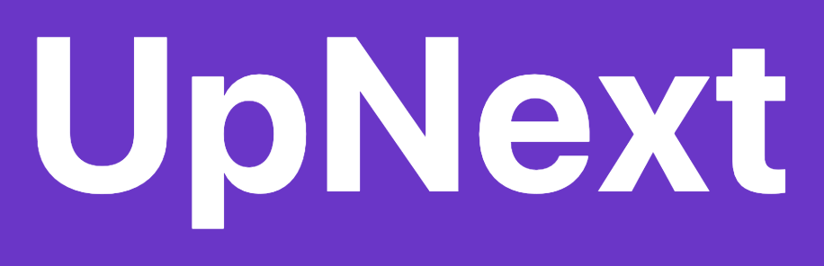

<a id="readme-top"></a>

<!-- PROJECT SHIELDS -->

[![Contributors][contributors-shield]][contributors-url]
[![Issues][issues-shield]][issues-url]
[![LinkedIn][linkedin-shield]][linkedin-url]

<!-- PROJECT LOGO -->
<br />
<div align="center">
  <a href="https://upnextqueue.netlify.app/">
    
  </a>

<br/>
  <p align="center">
    UpNext is an all-inclusive media consumption app that allows users to create queues/watch lists for Movies, TV Shows, Albums, Books, Podcasts, and Video Games. Users can create groups and invite others to shared queues where separate people can contribute different pieces of media that they want to watch/listen/read/play together. Users can search for, view details, and add different media to their respective queues, along with viewing other profiles to see what they have "UpNext".
    <br />
    <br />
    <a href="https://upnextqueue.netlify.app/">Deployed Site</a>
    &middot;
    <a href="https://github.com/lawrenceosher/upnext-node-server">Server Repo</a>

</div>

<!-- TABLE OF CONTENTS -->
<details>
  <summary>Table of Contents</summary>
  <ol>
    <li>
      <a href="#about-the-project">About The Project</a>
      <ul>
        <li><a href="#built-with">Built With</a></li>
      </ul>
    </li>
    <li>
      <a href="#getting-started">Getting Started</a>
      <ul>
        <li><a href="#prerequisites">Prerequisites</a></li>
        <li><a href="#installation">Installation</a></li>
      </ul>
    </li>
    <li><a href="#usage">Usage</a></li>
    <li><a href="#features">Features</a></li>
    <li><a href="#contributing">Contributing</a></li>
    <li><a href="#contact">Contact</a></li>
    <li><a href="#third-party-apis">Third Party APIs</a></li>
    <li><a href="#license">License</a></li>
  </ol>
</details>

<!-- ABOUT THE PROJECT -->

## About The Project

My idea for this project came about when my friends and I were sharing what media we wanted to watch/read/play/listen to, and everybody was texting lists from their notes app. Instead of maintaining a plain note, I wanted a way to organize and share my media consumption queues in a visually-appealing way. I also wanted a way to have a shared group queue that multiple people could add to instead of keeping a list that just one person could maintain. With this, UpNext was born.

#### Note

This is the repository for the client-side code. The backend node-server repository is located [here](https://github.com/lawrenceosher/upnext-node-server).

This repository consists of, but is not limited to:
- Client-side routes - ```/src/UpNext/index.tsx```
- Custom hooks - ```/src/UpNext/hooks```
- Reducers and Redux - ```/src/UpNext/redux```
- Components - ```/src/UpNext/components```
- Rendered pages - ```/src/UpNext/pages```
- Calls to backend API-  ```/src/UpNext/clients```

<p align="right">(<a href="#readme-top">back to top</a>)</p>

### Built With

- [![React][React.js]][React-url]
- [![Bootstrap][Bootstrap]][Bootstrap-url]
- [![Express][Express]][Express-url]
- [![MongoDB][MongoDB]][MongoDB-url]
- [![Node][Node]][Node-url]

<p align="right">(<a href="#readme-top">back to top</a>)</p>

<!-- GETTING STARTED -->

## Getting Started

To get a local copy up and running follow these simple steps.

### Prerequisites

- npm
  ```sh
  npm install npm@latest -g
  ```
- Local backend server must be running - follow the steps in the [backend repository](https://github.com/lawrenceosher/upnext-node-server)
- Node.js and MongoDB must be installed on your machine

### Installation

1. Clone the repo
   ```sh
   git clone https://github.com/lawrenceosher/UpNext-web-app.git
   ```
2. Install NPM packages
   ```sh
   npm install
   ```
3. Create /.env file with the following env variable.
   ```
   VITE_REMOTE_SERVER=http://localhost:4000
   ```
4. Run the project locally
   ```sh
   npm run dev
   ```

<p align="right">(<a href="#readme-top">back to top</a>)</p>

<!-- USAGE EXAMPLES -->

## Usage

You can use the site as an anonymous user (not logged-in) to view profiles and search for media, but you cannot create groups or queues. You can sign up with only a username and password to get access to all features.

### Home Page

[![Home Page][product-screenshot1]]()

### TV Queue Page

[![TV Queue Page][product-screenshot2]]()

### Profile Page

[![Profile Page][product-screenshot3]]()

### Users and Groups Page

[![Users and Groups Page][product-screenshot4]]()


<p align="right">(<a href="#readme-top">back to top</a>)</p>

<!-- FEATURES -->

## Features

- [Querying Media Databases] For each of the six media types (Movies, TV Shows, Albums, Books, Podcasts, Video Games), users can search for the media they want and click the summary card for more details. These results come from remote databases.
- [Queues (Personal) *] - Queue pages contain both the current and history queues, group queues, and the media search feature. The sidebar with different media icons takes you to the respective queue pages.
  - [Current] After searching for media, users can add it to the current queue by hitting the 'Add' button. Users can then see a list in the order of time added (oldest to newest) for what is up next to consume.
  - [History] After consuming the piece of media, you can check it off in your current queue and click the 'Submit' button to move it from your current queue to your history. You can then see the media in your history to keep track of what you have previously consumed. 
- [Group and Group Queues *] Users can create groups and invite other users. Users can then accept or decline the invitation by clicking on the 'Bell' icon in their profile page. With these groups, shared queues are created that have their own current and history queues, and users can each modify media that they want to consume together. A new queue is made for each of the six media types when a group is created.
- [Trending] See the top two most-added pieces of media for each the six categories. Each media item is clickable for more details.
- [Quick View] Collapsible lists are available in both the home page to view your personal current queues and profile pages (viewing personal history queues for your own profile and the top three in personal current queues for other users). When viewing your own profile, you also get a quick summary of your history that encapsulates all media you have already consumed.
- [Users and Profiles] Users can view each other's profiles to see what are the top media items in each of their queues.

'*' - Signifies that the user must be logged-in to access these features

See the [open issues](https://github.com/lawrenceosher/UpNext-web-app/issues) for a full list of future features and improvements.


<p align="right">(<a href="#readme-top">back to top</a>)</p>

### Top contributors:

<a href="https://github.com/lawrenceosher/UpNext-web-app/graphs/contributors">
  
</a>

<!-- CONTACT -->

## Contact

Lawrence Osher - osherlawrence@gmail.com

Project Link: [https://github.com/lawrenceosher/UpNext-web-app](https://github.com/lawrenceosher/UpNext-web-app)

<p align="right">(<a href="#readme-top">back to top</a>)</p>

## Third-Party APIs

- [TMDB](https://developer.themoviedb.org/docs/getting-started)
- [Spotify](https://developer.spotify.com/)
- [Google Books](https://developers.google.com/books)
- [IGDB](https://api-docs.igdb.com/#getting-started)

<p align="right">(<a href="#readme-top">back to top</a>)</p>

## License

This project is for personal use and demonstration purposes only. All rights reserved.

<p align="right">(<a href="#readme-top">back to top</a>)</p>

<!-- MARKDOWN LINKS & IMAGES -->

[contributors-shield]: https://img.shields.io/github/contributors/lawrenceosher/UpNext-web-app.svg?style=for-the-badge
[contributors-url]: https://github.com/lawrenceosher/UpNext-web-app/graphs/contributors
[forks-shield]: https://img.shields.io/github/forks/lawrenceosher/UpNext-web-app.svg?style=for-the-badge
[forks-url]: https://github.com/lawrenceosher/UpNext-web-app/network/members
[stars-shield]: https://img.shields.io/github/stars/lawrenceosher/UpNext-web-app.svg?style=for-the-badge
[stars-url]: https://github.com/lawrenceosher/UpNext-web-app/stargazers
[issues-shield]: https://img.shields.io/github/issues/lawrenceosher/UpNext-web-app.svg?style=for-the-badge
[issues-url]: https://github.com/lawrenceosher/UpNext-web-app/issues
[license-shield]: https://img.shields.io/github/license/lawrenceosher/UpNext-web-app.svg?style=for-the-badge
[license-url]: https://github.com/lawrenceosher/UpNext-web-app/blob/master/LICENSE.txt
[linkedin-shield]: https://img.shields.io/badge/-LinkedIn-black.svg?style=for-the-badge&logo=linkedin&colorB=555
[linkedin-url]: https://www.linkedin.com/in/losher/
[product-screenshot1]: public/homePage.png
[product-screenshot2]: public/queuePage.png
[product-screenshot3]: public/profilePageNew.png
[product-screenshot4]: public/groupsPage.png
[Next.js]: https://img.shields.io/badge/next.js-000000?style=for-the-badge&logo=nextdotjs&logoColor=white
[Next-url]: https://nextjs.org/
[React.js]: https://img.shields.io/badge/React-20232A?style=for-the-badge&logo=react&logoColor=61DAFB
[React-url]: https://reactjs.org/
[Bootstrap]: https://img.shields.io/badge/Bootstrap-563D7C?style=for-the-badge&logo=bootstrap&logoColor=white
[Bootstrap-url]: https://getbootstrap.com/
[Express]: https://img.shields.io/badge/Express.js-000000?logo=express&logoColor=fff&style=flat
[Express-url]: https://expressjs.com/
[MongoDB]: https://img.shields.io/badge/-MongoDB-13aa52?style=for-the-badge&logo=mongodb&logoColor=white
[MongoDB-url]: https://www.mongodb.com/
[Node]: https://img.shields.io/badge/node.js-339933?style=for-the-badge&logo=Node.js&logoColor=white
[Node-url]: https://nodejs.org/en
[Vue.js]: https://img.shields.io/badge/Vue.js-35495E?style=for-the-badge&logo=vuedotjs&logoColor=4FC08D
[Vue-url]: https://vuejs.org/
[Angular.io]: https://img.shields.io/badge/Angular-DD0031?style=for-the-badge&logo=angular&logoColor=white
[Angular-url]: https://angular.io/
[Svelte.dev]: https://img.shields.io/badge/Svelte-4A4A55?style=for-the-badge&logo=svelte&logoColor=FF3E00
[Svelte-url]: https://svelte.dev/
[Laravel.com]: https://img.shields.io/badge/Laravel-FF2D20?style=for-the-badge&logo=laravel&logoColor=white
[Laravel-url]: https://laravel.com
[Bootstrap.com]: https://img.shields.io/badge/Bootstrap-563D7C?style=for-the-badge&logo=bootstrap&logoColor=white
[Bootstrap-url]: https://getbootstrap.com
[JQuery.com]: https://img.shields.io/badge/jQuery-0769AD?style=for-the-badge&logo=jquery&logoColor=white
[JQuery-url]: https://jquery.com
